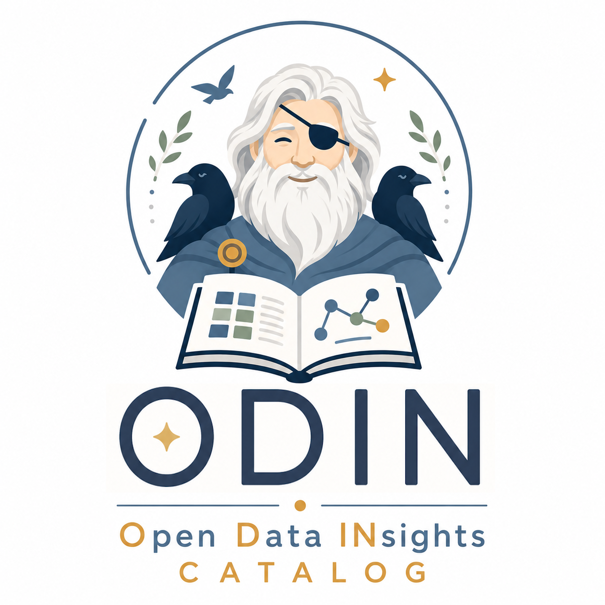

<p align="center">
  
</p>

<h1 align="center">ODIN Catalog</h1>

<p align="center">
  Open-source data catalog built on W3C/OMG standards — DCAT 3.0, DPROD, CSV-W, OpenLineage, FIBO, and SKOS.
</p>

---

## Overview

ODIN Catalog is a metadata platform for discovering, governing, and understanding data assets across your organisation. It provides a three-tier conceptual → logical → physical metamodel:

- **Conceptual** — Data Products and Ports (DPROD)
- **Logical** — Datasets, Logical Models, and Vocabulary Mappings (DCAT + SKOS + FIBO)
- **Physical** — Distributions and harvested schemas (CSV-W + AWS Glue + Snowflake + Teradata)

Lineage is tracked using the OpenLineage standard via an Apache AGE graph database (Cypher over PostgreSQL).

---

## Architecture

Six Spring Boot 3.3 / Java 21 microservices, each with its own database:

| Service | Port | Database | Responsibility |
|---------|------|----------|---------------|
| `inventory-service` | 8001 | PostgreSQL | Catalogs, Datasets, Distributions, Data Products, Logical Models, Vocabularies |
| `harvest-service` | 8002 | PostgreSQL + MinIO | Connector pipeline — DCAT HTTP, AWS Glue, Snowflake, Teradata |
| `lineage-service` | 8003 | PostgreSQL + Apache AGE | OpenLineage ingestion, DDL lineage, Cypher graph traversal |
| `search-service` | 8004 | OpenSearch | Full-text search, faceted filtering, semantic facets (FIBO concepts) |
| `ai-service` | 8005 | PostgreSQL + pgvector | RAG chat, semantic search, embedding pipeline (Ollama / OpenAI) |
| `identity-service` | 8006 | PostgreSQL | Organisations, domains, users, roles, ABAC policies, API keys |

Two React 18 + TypeScript + Vite frontends:

| App | Port | Audience |
|-----|------|----------|
| `consumer` | 3001 | Analysts and data consumers — zero-navigation search and discovery |
| `producer` | 3000 | Data owners and stewards — data product management and governance |

Traefik routes `catalog.local/` → consumer and `manage.catalog.local/` → producer.

---

## Quick Start

**Prerequisites:** Docker 24+, Docker Compose v2, Java 21, Node 20.

```bash
# Clone
git clone https://github.com/odin-catalog/odin.git
cd odin-catalog

# Copy environment template
cp .env.example .env

# Start the full stack (infrastructure + all services)
make up

# Or with Ollama for local AI (requires ~8 GB RAM)
make up-ai
```

The stack takes about 60 seconds to reach healthy status. Check with:

```bash
docker compose ps
```

Once up:

| URL | What |
|-----|------|
| `http://localhost:3001` | Consumer (discovery) UI |
| `http://localhost:3000` | Producer (management) UI |
| `http://localhost:8001/swagger-ui.html` | inventory-service API docs |
| `http://localhost:8002/swagger-ui.html` | harvest-service API docs |
| `http://localhost:8003/swagger-ui.html` | lineage-service API docs |
| `http://localhost:8004/swagger-ui.html` | search-service API docs |
| `http://localhost:8005/swagger-ui.html` | ai-service API docs |
| `http://localhost:8006/swagger-ui.html` | identity-service API docs |
| `http://localhost:8180` | Keycloak admin console |
| `http://localhost:9000` | MinIO console |

---

## Development

### Backend (Java / Gradle)

```bash
# Build all services (skip tests)
make build-backend

# Run all tests
make test

# Test a single service
make test-svc svc=inventory-service

# Build and restart a service after code changes
docker compose build inventory-service && docker compose up -d inventory-service
```

### Frontend

```bash
# Install dependencies
cd frontend && npm install

# Run consumer dev server (hot reload, port 3001)
make dev-consumer

# Run producer dev server (hot reload, port 3000)
make dev-producer

# Build both apps for production
make build-frontend
```

### Database migrations

Flyway migrations run automatically on service startup. To run them manually:

```bash
make migrate
```

### Seed data

```bash
# Seed system vocabularies (schema.org, FIBO, SKOS)
make seed-vocab

# Load the Meridian Capital sample dataset (investment bank scenario)
make seed
```

---

## Standards

| Standard | Role |
|----------|------|
| [DCAT 3.0](https://www.w3.org/TR/vocab-dcat-3/) | Dataset and Distribution metadata; catalog export as JSON-LD |
| [DPROD](https://www.w3.org/TR/dprod/) | Data Product, Port, and DataService model |
| [CSV-W](https://www.w3.org/TR/tabular-data-primer/) | Physical schema descriptor (columns, datatypes, constraints) |
| [OpenLineage](https://openlineage.io/) | Job/Run/Dataset lineage events; compatible with Marquez and dbt |
| [SKOS](https://www.w3.org/TR/skos-reference/) | Vocabulary mapping properties (exactMatch, closeMatch, …) |
| [FIBO](https://spec.edmcouncil.org/fibo/) | Financial industry business ontology for semantic annotation |
| [schema.org](https://schema.org/) | General-purpose vocabulary for non-financial datasets |

---

## Monorepo Layout

```
data-catalog/
├── services/
│   ├── inventory-service/    # Catalog, Dataset, DataProduct, Logical Model APIs
│   ├── harvest-service/      # Connectors, Spring Batch pipeline, Quartz scheduler
│   ├── lineage-service/      # OpenLineage ingestion, Apache AGE graph
│   ├── search-service/       # OpenSearch indexing and query
│   ├── ai-service/           # RAG chat, embeddings, semantic search
│   └── identity-service/     # Users, roles, ABAC, API keys, Keycloak integration
├── shared/
│   ├── shared-models/        # Java records for DCAT, DPROD, CSV-W, Kafka envelopes
│   ├── kafka-client/         # KafkaEventPublisher, KafkaEventConsumer, topic constants
│   └── auth-common/          # Spring Security JWT filter, @RequiresPermission
├── frontend/
│   ├── consumer/             # Discovery app (port 3001)
│   ├── producer/             # Management app (port 3000)
│   └── shared/               # TypeScript types and typed API clients
├── infra/
│   ├── traefik/              # Traefik routing config
│   ├── kafka/                # Topic definitions
│   ├── keycloak/             # Realm export
│   └── opensearch/           # Index mappings
├── marketing/                # Marketing landing page
├── docker-compose.yml
├── Makefile
└── gradle/libs.versions.toml # Gradle version catalog
```

---

## API Authentication

All backend endpoints accept either:

- `Authorization: Bearer <JWT>` — Keycloak-issued OIDC token
- `X-API-Key: <key>` — long-lived API key (managed by identity-service)

For local development, use `X-API-Key: dev-inventory` (or `dev-harvest`, `dev-search`, etc.) to bypass JWT validation.

---

## Infrastructure Services

| Service | Port | Purpose |
|---------|------|---------|
| postgres-inventory | 5433 | inventory-service DB |
| postgres-harvest | 5434 | harvest-service DB |
| postgres-lineage | 5435 | lineage-service DB (Apache AGE) |
| postgres-identity | 5436 | identity-service DB |
| postgres-ai | 5437 | ai-service DB (pgvector) |
| Kafka (KRaft) | 9092 | Event bus |
| Apicurio Registry | 8085 | Kafka schema registry |
| OpenSearch | 9200 | Search engine |
| MinIO | 9000 | Object store (harvest snapshots, DDL files) |
| Redis | 6379 | Quartz scheduler lock store |
| Keycloak | 8180 | Identity provider (OAuth2/OIDC) |
| Traefik | 80 | API gateway and routing |

---

## License

Apache 2.0 — see [LICENSE](LICENSE).
